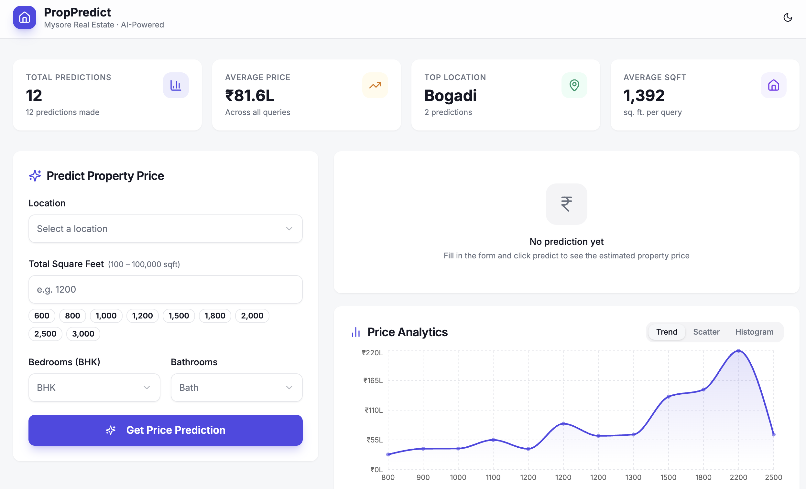

# 🏠 PropPredict 

### AI-Powered Real Estate Price Prediction System



---

## 📌 Project Overview

**PropPredict** is a full-stack web application that predicts real estate property prices using machine learning. It combines a modern frontend, a backend API, and a trained model to provide **accurate, real-time predictions with visual insights**.

The system is designed with scalability and modularity in mind, making it suitable for both development and deployment environments.

---

## 🧠 About

This application runs locally during development and can be deployed online.

**Base44 is used only as a hosting/deployment platform** and does not impact the application’s logic, architecture, or functionality.

The project follows a **separation of concerns architecture**, ensuring clear distinction between UI, API, and machine learning components.

---

## 🚀 Features

* 📊 Real-time property price prediction
* 🧠 Machine learning integration (scikit-learn)
* 📍 Location-based insights
* 📈 Interactive price visualization
* 🔄 Property comparison panel
* 🧾 Recent predictions tracking
* 📱 Fully responsive UI

---

## 🏗️ Tech Stack

### Frontend

* React (Vite)
* Tailwind CSS
* JavaScript (ES6+)

### Backend

* Python (Flask API)

### Machine Learning

* scikit-learn (Linear Regression Model)

### Deployment

* Base44 (Hosting only)

---

## 📁 Project Structure

```bash
PropPredict/
│
├── client/                # Frontend (React + Vite)
│   └── src/
│       ├── api/           # API calls
│       ├── components/    # UI + dashboard components
│       │   ├── dashboard/
│       │   └── ui/
│       ├── context/       # Global state management
│       ├── hooks/         # Custom hooks
│       ├── lib/           # Core logic & configs
│       ├── pages/         # Route-level components
│       ├── services/      # API abstraction layer
│       └── utils/         # Helper functions
│
├── server/                # Flask backend API
├── model/                 # ML model artifacts (pickle)
│
├── package.json
├── vite.config.js
├── tailwind.config.js
└── README.md
```

---

## ⚙️ Local Development Setup

### ✅ Prerequisites

* Node.js installed
* Python (3.x) installed
* Git installed

---

### 📥 Steps

#### 1️⃣ Clone the repository

```bash
git clone https://github.com/your-username/PropPredict.git
cd PropPredict
```

---

#### 2️⃣ Setup Frontend

```bash
cd client
npm install
```

---

#### 3️⃣ Setup Backend

```bash
cd ../server
pip install -r requirements.txt
```

---

#### 4️⃣ Environment Configuration

Create a `.env.local` file in the **client root directory**:

```env
VITE_BASE44_APP_ID=your_app_id
VITE_BASE44_APP_BASE_URL=your_backend_url
```

**Example:**

```env
VITE_BASE44_APP_ID=cbef744a8545c389ef439ea6
VITE_BASE44_APP_BASE_URL=https://your-backend-url.com
```

---

## ▶️ Run the Application

### Start Backend

```bash
cd server
python app.py
```

### Start Frontend

```bash
cd client
npm run dev
```

---

### 🌐 Local URLs

* Frontend → [http://localhost:5173](http://localhost:5173)
* Backend → [http://localhost:5000](http://localhost:5000)

---

## 🔄 Application Workflow

1. User inputs property details
2. Frontend sends request via API
3. Backend processes input
4. ML model generates prediction
5. Results displayed with charts and insights

---

## 🧠 Machine Learning

* **Model:** Linear Regression
* **Input:** Property features (area, location, etc.)
* **Output:** Predicted price

### Why Linear Regression?

* Fast and efficient
* Interpretable results
* Suitable for structured datasets

---

## 🔐 Security & Validation

* Input validation before API requests
* Error handling for invalid inputs
* Protected routes (if authentication is enabled)

---

## ⚡ Performance Optimization

* Vite for fast development builds
* Component-based rendering
* Efficient state management using React Context

---

## 🚀 Deployment

To deploy the application:

* Use **Base44 as a hosting platform only**
* Push your repository
* Deploy via Base44 dashboard

### 🔁 Alternative Hosting Options

You can also deploy using:

* Vercel (frontend)
* Netlify (frontend)
* Render / Railway (backend)

---

## 📊 Core Modules

* 🧾 Prediction Form
* 💰 Price Result Display
* 📈 Price Chart
* 🗺️ Map View
* ⚖️ Comparison Panel
* 📊 Dashboard Insights

---

## ⚠️ Limitations

* Model depends on dataset quality
* Linear regression may not capture complex patterns
* No real-time market API integration

---

## 🔮 Future Enhancements

* Advanced ML models (XGBoost, Random Forest)
* Real-time real estate APIs
* User authentication system
* Cloud deployment (AWS / GCP / Azure)
* Recommendation engine

---

## 🤝 Contributing

Contributions are welcome!

1. Fork the repository
2. Create a new branch
3. Commit your changes
4. Submit a pull request

---

## 📄 License

This project is licensed under the MIT License.

---

## 👨‍💻 Author

**Darshan Suresh**
GitHub: [[https://github.com/your-username](https://github.com/DarshanSuresh)]

---

## ⭐ Support

If you found this project useful, consider giving it a ⭐ — it helps visibility and growth.

---

## 📌 Notes

* The application is **independent of Base44**
* Base44 is used **only for deployment**
* The system can be hosted on any platform without changes

---
